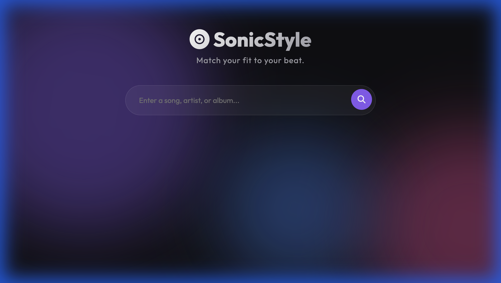
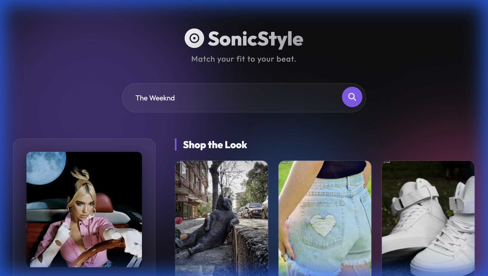

# SonicStyle | Listen & Look the Part

**SonicStyle** is an interactive web application that bridges the gap between music and fashion. By analyzing the "vibe" of your favorite songs, artists, or albums, using the Apple Music API, it recommends a curated selection of fashion items from Amazon that match that specific aesthetic.

**Repository**: [https://github.com/vikbht/musicreco](https://github.com/vikbht/musicreco)
**Architecture**: [View Documentation](docs/ARCHITECTURE.md)

| Home Page | Search Results |
|:---:|:---:|
|  |  |

## 🎵 Features
- **Music Search**: Find any song, artist, or album.
- **Vibe Engine**: Automatically detects the aesthetic (e.g., *Grunge, Disco, Synth-Pop*) based on genre and mood.
- **Fashion Recommendations**: Get "Shop the Look" suggestions matching the detected vibe.
- **Mock Mode**: Fully functional demo mode working immediately without API keys.

## 🚀 Quick Start

This project uses `uv` for lightning-fast dependency management.

### Prerequisites
- Python 3.12+
- [uv](https://github.com/astral-sh/uv) (Package Manager)

### Installation & Run

1.  **Clone & Run**:
    ```bash
    # No manual install needed! uv handles virtualenv and deps.
    uv run uvicorn app.main:app --reload --host 0.0.0.0 --port 8000
    ```

2.  **Open the App**:
    Visit [http://localhost:8000](http://localhost:8000)

## 🔑 Configuration (API Keys)

By default, the app runs in **Mock Mode**, returning simulated data for "Nirvana", "The Weeknd", etc. To enable real data, you need to configure API keys.

1.  **Create configuration file**:
    ```bash
    cp .env.example .env
    ```

2.  **Add your Keys** in `.env`:

    - **Apple Music API**:
      Required to fetch real song metadata and genres.
      - `APPLE_MUSIC_TOKEN`: Your Developer Token (JWT).

    - **Amazon Product API**:
      Required to search for real products on Amazon.
      - `AMAZON_ACCESS_KEY`: AWS Access Key ID.
      - `AMAZON_SECRET_KEY`: AWS Secret Key.
      - `AMAZON_PARTNER_TAG`: Your Associate Tag.

    *Note: The app checks for these keys on startup. If missing, it gracefully degrades to Mock Mode.*

## 🛠️ Tech Stack
- **Backend**: FastAPI (Python)
- **Frontend**: HTML5, CSS3 (Glassmorphism), Jinja2 Templates
- **Package Manager**: uv
