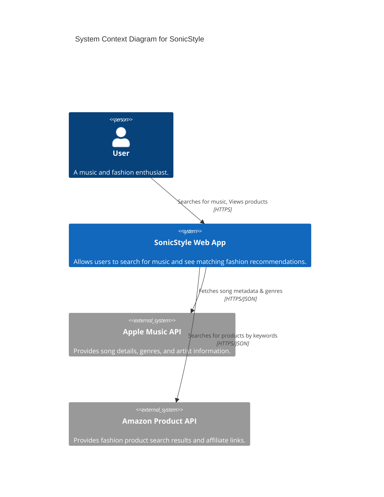
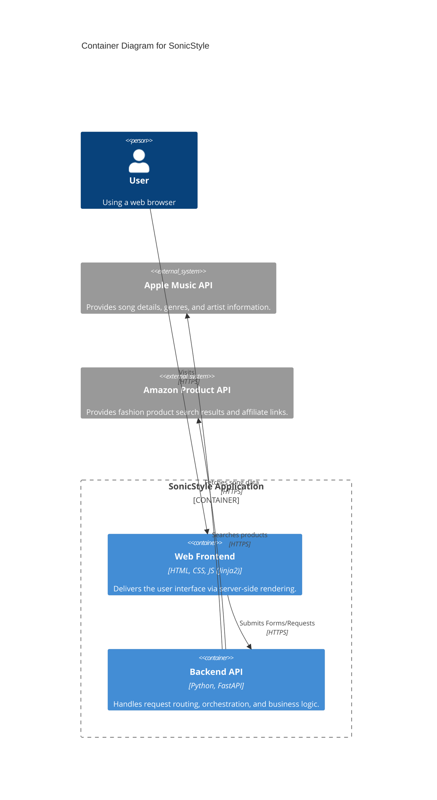
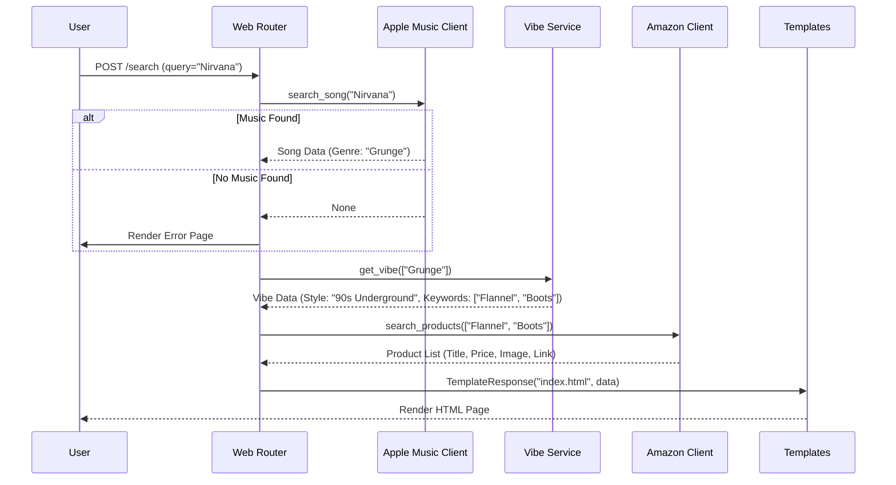

# SonicStyle Software Architecture

## Overview
**SonicStyle** is a web application that bridges the gap between music and fashion. It analyzes the "vibe" of a user's music choice (artist, song, album) and recommends fashion items that match that aesthetic.

## System Context (C4 Level 1)
The following diagram illustrates the high-level context of the SonicStyle system and its external dependencies.



## Container Diagram (C4 Level 2)
This diagram shows the high-level breakdown of the internal containers and components.



## Sequence Diagram: Search Flow
The core workflow of the application is the search process.



## Project Structure
The code is organized as a modular FastAPI application managed by `uv`.

```
musicreco/
├── app/
│   ├── main.py              # Application Entry Point
│   ├── routers/
│   │   └── web.py           # Web Routes (Search Logic)
│   ├── services/
│   │   ├── apple_music.py   # Music API Wrapper
│   │   ├── amazon.py        # Shopping API Wrapper
│   │   └── vibes.py         # Business Logic (Vibe Translation)
│   ├── static/
│   │   └── css/
│   │       └── style.css    # Premium Styling
│   └── templates/
│       └── index.html       # Main UI Template
├── pyproject.toml           # Dependency Management (uv)
└── uv.lock                  # Locked Dependencies
```

## Technology Stack

| Component | Technology | Rationale |
| :--- | :--- | :--- |
| **Language** | Python 3.12+ | Rich ecosystem, ease of API integration. |
| **Framework** | FastAPI | High performance, async support, easy to structure. |
| **Dependency Manager** | uv | Extremely fast, reliable modern package management. |
| **Templating** | Jinja2 | Standard for Python server-side rendering. |
| **Styling** | Vanilla CSS3 | Custom high-end "Glassmorphism" design without framework bloat. |
| **Server** | Uvicorn | ASGI server for production-grade performance. |

## Design Decisions
1.  **Mock Mode Logic**: To reduce friction for new developers (and evaluation), the API Clients (`AppleMusicClient`, `AmazonClient`) are designed to seamlessly switch to "Mock Mode" if API keys are not detected in the environment. This ensures the app is always runnable.
2.  **Server-Side Rendering (SSR)**: Chosen over a SPA (Single Page App) for simplicity and speed of development given the purely informational/search-based nature of the initial requirements.
3.  **Vibe Dictionary**: The mapping logic is currently purely rule-based (Genre -> Keywords) mapped in `vibes.py`. This allows for deterministic testing before implementing more complex AI/ML matching logic.
